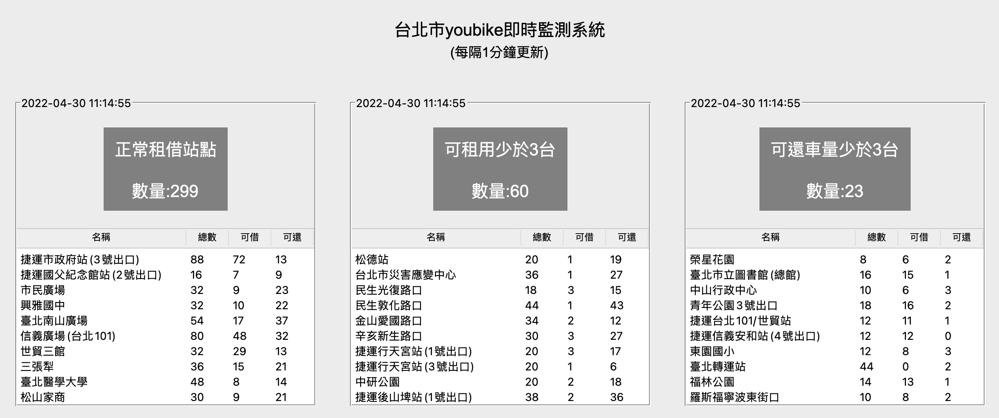

# 顯示所有資料



### 主程式.py

```python
import dataSource
import tkinter as tk
from datetime import datetime
from tkinter import ttk

class Window(tk.Tk):
    def __init__(self):
        super().__init__()
        #上方的Frame=========start
        topFrame = tk.Frame(self)
        tk.Label(topFrame,text="台北市youbike即時監測系統",font=("arial",20)).pack()
        tk.Label(topFrame,text="(每隔1分鐘更新)",font=("arial",16)).pack()
        topFrame.grid(column=0,row=0,columnspan=3,padx=20,pady=20)
        #上方的Frame=========end
        self.leftLabelFrame =LeftLabelFrame(self,text="左邊的")
        self.leftLabelFrame.grid(column=0,row=1,padx=20,pady=20)
        self.centerLabelFrame = CenterLabelFrame(self,text="中間的")
        self.centerLabelFrame.grid(column=1,row=1,padx=20,pady=20)
        self.rightLabelFrame = RightLabelFrame(self,text="右邊的")
        self.rightLabelFrame.grid(column=2, row=1, padx=20, pady=20)
        self.update_data()


    def update_data(self):
        nowString = datetime.now().strftime("%Y-%m-%d %H:%M:%S")
        self.leftLabelFrame.configure(text=nowString)
        self.centerLabelFrame.configure(text=nowString)
        self.rightLabelFrame.configure(text=nowString)
        dataSource.update_youbike_data()
        self.leftLabelFrame.clear_treeView()
        self.leftLabelFrame.display_treeView()
        self.centerLabelFrame.clear_treeView()
        self.centerLabelFrame.display_treeView()
        self.rightLabelFrame.clear_treeView()
        self.rightLabelFrame.display_treeView()
        print("update")
        self.updateId = self.after(1000 * 60, self.update_data)

class LeftLabelFrame(tk.LabelFrame):
    def __init__(self, *args , **kwargs):
        super().__init__(*args, **kwargs)
        topFrame = tk.Frame(self,background='gray')
        tk.Label(topFrame, text="正常租借站點", font=("arial", 20),background='gray',fg="white").pack(padx=10,pady=10)
        normal_count = dataSource.get_count_of_normal()
        tk.Label(topFrame, text=f"數量:{normal_count}",background='gray',fg='#ffffff', font=("arial",20)).pack(padx=10,pady=10)
        topFrame.pack(pady=20)
        self.treeView = ttk.Treeview(self,columns=('sna','tot','sbi','bemp'),show="headings")
        self.treeView.heading('sna',text='名稱')
        self.treeView.heading('tot', text='總數')
        self.treeView.heading('sbi', text='可借')
        self.treeView.heading('bemp', text='可還')

        self.treeView.column('sna',width=200)
        self.treeView.column('tot',width=50)
        self.treeView.column('sbi',width=50)
        self.treeView.column('bemp',width=50)
        self.treeView.pack()
        self.display_treeView()

    def clear_treeView(self):
        # 清除tree內容
        for i in self.treeView.get_children():
            self.treeView.delete(i)

    def display_treeView(self):
        normal_list = dataSource.get_list_of_normal()
        for item in normal_list:
            itemList = list(item.values())
            self.treeView.insert('', 'end', values=itemList)

class CenterLabelFrame(tk.LabelFrame):
    def __init__(self, *args, **kwargs):
        super().__init__(*args, **kwargs)
        topFrame = tk.Frame(self, background='gray')
        tk.Label(topFrame, text="可租用少於3台", font=("arial", 20), background='gray', fg="white").pack(padx=10, pady=10)
        normal_count = dataSource.get_count_of_less_bike()
        tk.Label(topFrame, text=f"數量:{normal_count}", background='gray', fg='#ffffff', font=("arial", 20)).pack(padx=10,
                                                                                                                pady=10)
        topFrame.pack(pady=20)
        self.treeView = ttk.Treeview(self, columns=('sna', 'tot', 'sbi', 'bemp'), show="headings")
        self.treeView.heading('sna', text='名稱')
        self.treeView.heading('tot', text='總數')
        self.treeView.heading('sbi', text='可借')
        self.treeView.heading('bemp', text='可還')

        self.treeView.column('sna', width=200)
        self.treeView.column('tot', width=50)
        self.treeView.column('sbi', width=50)
        self.treeView.column('bemp', width=50)
        self.treeView.pack()
        self.display_treeView()

    def clear_treeView(self):
        # 清除tree內容
        for i in self.treeView.get_children():
            self.treeView.delete(i)

    def display_treeView(self):
        less_list = dataSource.get_list_of_less_bike()
        for item in less_list:
            itemList = list(item.values())
            self.treeView.insert('', 'end', values=itemList)

class RightLabelFrame(tk.LabelFrame):
    def __init__(self, *args, **kwargs):
        super().__init__(*args, **kwargs)
        topFrame = tk.Frame(self, background='gray')
        tk.Label(topFrame, text="可還車量少於3台", font=("arial", 20), background='gray', fg="white").pack(padx=10, pady=10)
        normal_count = dataSource.get_count_of_less_stop()
        tk.Label(topFrame, text=f"數量:{normal_count}", background='gray', fg='#ffffff', font=("arial", 20)).pack(padx=10,
                                                                                                                pady=10)
        topFrame.pack(pady=20)
        self.treeView = ttk.Treeview(self, columns=('sna', 'tot', 'sbi', 'bemp'), show="headings")
        self.treeView.heading('sna', text='名稱')
        self.treeView.heading('tot', text='總數')
        self.treeView.heading('sbi', text='可借')
        self.treeView.heading('bemp', text='可還')

        self.treeView.column('sna', width=200)
        self.treeView.column('tot', width=50)
        self.treeView.column('sbi', width=50)
        self.treeView.column('bemp', width=50)
        self.treeView.pack()
        self.display_treeView()

    def clear_treeView(self):
        # 清除tree內容
        for i in self.treeView.get_children():
            self.treeView.delete(i)

    def display_treeView(self):
        less_stop_list = dataSource.get_list_of_less_stop()
        for item in less_stop_list:
            itemList = list(item.values())
            self.treeView.insert('', 'end', values=itemList)

if __name__=="__main__":
    dataSource.update_youbike_data()
    window = Window()
    window.title("台北市youbike及時監測資料")
    window.mainloop()

```


### dataSource.py

```python
import requests
from requests import ConnectionError,HTTPError,Timeout
import pymysql.cursors
from pymysql import Error

databasName = 'youbike.db'


__all__ = ['update_youbike_data','get_count_of_normal','get_list_of_normal']

def create_connection():
    connection = None
    try:
        connection = pymysql.connect(host='localhost',
                                     user='root',
                                     password='12341234',
                                     database='world',
                                     charset='utf8mb4',
                                     cursorclass=pymysql.cursors.DictCursor)
    except Error as e:
        print(e)
    return connection

def download_youbike_data():
    youbikeurl = "https://tcgbusfs.blob.core.windows.net/blobyoubike/YouBikeTP.json"
    try:
        response = requests.get(youbikeurl)
        response.raise_for_status()
    except ConnectionError as e:
        print("網路連線有問題")
        print(e)
        return
    except HTTPError as e:
        print("statusCode不是200,連線取得資料有問題")
        print(e)
        return
    except Timeout as e:
        print("伺服器忙線中")
        print(e)
        return
    except:
        print("不預期的錯誤")
        return

    allData = response.json()
    #解析資料,傳出[{:}]
    return list(allData["retVal"].values())


def create_table(conn):
    create_table_sql = '''
    CREATE TABLE IF NOT EXISTS youbike (
	id BIGINT AUTO_INCREMENT,
	sno VARCHAR(6) NOT NULL,
	sna VARCHAR(50),
	tot SMALLINT UNSIGNED ,
	sbi SMALLINT UNSIGNED ,
	sarea VARCHAR(10) ,
	mday DATETIME,
	lat REAL,
	lng REAL,
	ar VARCHAR(100),
	bemp SMALLINT UNSIGNED,
	act TINYINT,
	PRIMARY KEY(id),
	UNIQUE (sno)
    );
    '''
    with conn.cursor() as cursor:
        try:
            cursor.execute(create_table_sql)
        except Error as e:
            print(e)


from datetime import datetime
def update_data(conn,downloadData):
    def change_datetime_format(d):
        datetime_object = datetime.strptime(d,'%Y%m%d%H%M%S')
        return datetime_object.strftime('%Y-%m-%d %H:%M:%S')


    replace_into_sql = '''
    REPLACE INTO youbike(sno,sna,tot,sbi,sarea,mday,lat,lng,ar,bemp,act)
    VALUES (%s,%s,%s,%s,%s,%s,%s,%s,%s,%s,%s);
    '''
    with conn.cursor() as cursor:
        for item in downloadData:
            sno = item['sno']
            sna = item['sna']
            tot = int(item['tot'])
            sbi = int(item['sbi'])
            sarea = item['sarea']
            mday = change_datetime_format(item['mday'])
            lat = float(item['lat'])
            lng = float(item['lng'])
            ar = item['ar']
            bemp = int(item['bemp'])
            act = int(item['act'])
            cursor.execute(replace_into_sql,(sno,sna,tot,sbi,sarea,mday,lat,lng,ar,bemp,act))
        conn.commit()


def update_youbike_data():
    datalist = download_youbike_data()
    conn = create_connection()
    with conn:
        create_table(conn)
        update_data(conn,datalist)


def get_count_of_normal():
    conn = create_connection()
    sql = '''
    SELECT count(*) as 正常數量
    FROM youbike
    WHERE act = 1 AND sbi > 3 AND bemp >3
    '''
    with conn:
        with conn.cursor() as cursor:
            try:
                cursor.execute(sql)
                row = cursor.fetchone()
                print(row)
            except Error as e:
                print(e)
    return row['正常數量']

def get_list_of_normal():
    conn = create_connection()
    sql = '''
        SELECT sna,tot,sbi,bemp
        FROM youbike
        WHERE act = 1 AND sbi > 3 AND bemp >3
        '''
    with conn:
        with conn.cursor() as cursor:
            try:
                cursor.execute(sql)
                rows = cursor.fetchall()
                print(rows)
            except Error as e:
                print(e)
    return rows

def get_count_of_less_bike():
    conn = create_connection()
    sql = '''
    SELECT count(*) as 正常數量
    FROM youbike
    WHERE act = 1 AND sbi <= 3
    '''
    with conn:
        with conn.cursor() as cursor:
            try:
                cursor.execute(sql)
                row = cursor.fetchone()
                print(row)
            except Error as e:
                print(e)
    return row['正常數量']

def get_list_of_less_bike():
    conn = create_connection()
    sql = '''
        SELECT sna,tot,sbi,bemp
        FROM youbike
        WHERE act = 1 AND sbi <= 3
        '''
    with conn:
        with conn.cursor() as cursor:
            try:
                cursor.execute(sql)
                rows = cursor.fetchall()
                print(rows)
            except Error as e:
                print(e)
    return rows

def get_count_of_less_stop():
    conn = create_connection()
    sql = '''
    SELECT count(*) as 正常數量
    FROM youbike
    WHERE act = 1 AND bemp <= 3 
    '''
    with conn:
        with conn.cursor() as cursor:
            try:
                cursor.execute(sql)
                row = cursor.fetchone()
                print(row)
            except Error as e:
                print(e)
    return row['正常數量']

def get_list_of_less_stop():
    conn = create_connection()
    sql = '''
        SELECT sna,tot,sbi,bemp
        FROM youbike
        WHERE act = 1 AND bemp <= 3
        '''
    with conn:
        with conn.cursor() as cursor:
            try:
                cursor.execute(sql)
                rows = cursor.fetchall()
                print(rows)
            except Error as e:
                print(e)
    return rows
 
```