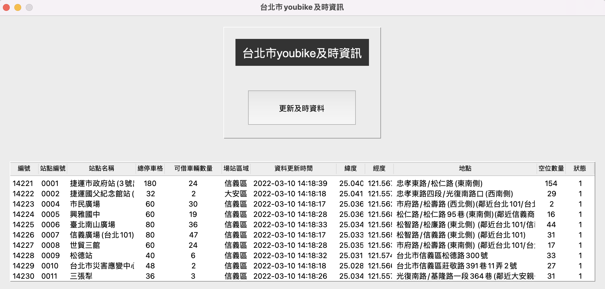

# 顯示所有資料



### lesson2.py

```python
import dataSource
import tkinter as tk
from tkinter import ttk

class Window(tk.Tk):
    def __init__(self):
        super().__init__()
        # topFrame ========== 開始
        topFrame = tk.Frame(self, relief=tk.GROOVE, borderwidth=1, width=300, height=200)
        tk.Label(topFrame, text="台北市youbike及時資訊", font=("arial", 20), bg="#333333", fg='#ffffff', padx=10, pady=10).pack(
            pady=20,padx=20)

        def update_button_click():
            youbikeInfo = dataSource.loadDataFraomYouBikeTP()
            dataSource.update_data(youbikeInfo)
            self.display_treeView()

        tk.Button(topFrame, text="更新及時資料", padx=40, pady=20, command=update_button_click).pack(pady=20)
        topFrame.pack(padx=20, pady=20)
        # topFrame ========== 結束

        #bottomFrame ==========開始
        bottomFrame = tk.Frame(self, relief=tk.GROOVE, borderwidth=1, width=300, height=200)
        self.tree = ttk.Treeview(bottomFrame, columns=('id', 'sno', 'sna', 'tot', 'sbi', 'sarea','mday','lat','lng','ar','bemp','act'), show='headings')
        self.tree.heading('id',text="編號")
        self.tree.heading('sno',text='站點編號')
        self.tree.heading('sna',text='站點名稱')
        self.tree.heading('tot', text='總停車格')
        self.tree.heading('sbi', text='可借車輛數量')
        self.tree.heading('sarea',text= '場站區域')
        self.tree.heading('mday', text='資料更新時間')
        self.tree.heading('lat', text='緯度')
        self.tree.heading('lng',text='經度')
        self.tree.heading('ar', text='地點')
        self.tree.heading('bemp',text='空位數量')
        self.tree.heading('act', text='狀態')

        self.tree.column('id',width=50)
        self.tree.column('sno', width=50)
        self.tree.column('sna', width=120)
        self.tree.column('tot', width=50,anchor=tk.CENTER)
        self.tree.column('sbi', width=100,anchor=tk.CENTER)
        self.tree.column('sarea', width=50)
        self.tree.column('mday', width=150)
        self.tree.column('lat', width=50)
        self.tree.column('lng', width=50)
        self.tree.column('ar', width=250)
        self.tree.column('bemp', width=50,anchor=tk.CENTER)
        self.tree.column('act', width=50,anchor=tk.CENTER)
        self.tree.pack(side=tk.TOP)

        bottomFrame.pack(padx=20, pady=20)
        #bottomFrame ==========結束
        self.display_treeView()

    def display_treeView(self):
        #清除tree內容
        for i in self.tree.get_children():
            self.tree.delete(i)

        all_siteInfos = dataSource.get_siteInfo()
        #all_siteInfos[{}]
        for one_site in all_siteInfos:
            id = one_site['id']
            sno = one_site['sno']
            sna = one_site['sna']
            tot = one_site['tot']
            sbi = one_site['sbi']
            sarea = one_site['sarea']
            mday = one_site['mday']
            #轉換mday為字串格式
            mday = mday.strftime('%Y-%m-%d %H:%M:%S')
            lat = one_site['lat']
            lng = one_site['lng']
            ar = one_site['ar']
            bemp = one_site['bemp']
            act = one_site['act']
            siteInfo = (id,sno,sna,tot,sbi,sarea,mday,lat,lng,ar,bemp,act)
            self.tree.insert('', tk.END, values=siteInfo)


if __name__ == "__main__":
    #下載資料和顯示資料
    youbikeInfo = dataSource.loadDataFraomYouBikeTP()
    dataSource.update_data(youbikeInfo)

    #視窗介面
    window = Window()
    window.resizable(0, 0) #無法改變視窗大小
    window.geometry("+300+300")
    window.title("台北市youbike及時資訊")
    window.mainloop()
```


### dataSource.py

```
#台北市串接Youbike網址
#https://tcgbusfs.blob.core.windows.net/blobyoubike/YouBikeTP.json
'''
sno(站點代號)、sna(場站中文名稱)、tot(場站總停車格)、sbi(場站目前車輛數量)、sarea(場站區域)、mday(資料更新時間)、lat(緯度)、lng(經度)、ar(地點)、sareaen(場站區域英文)、snaen(場站名稱英文)、aren(地址英文)、bemp(空位數量)、act(全站禁用狀態)
'''
import requests
import pymysql.cursors
from pymysql import Error

def create_connection():
    connection = None
    try:
        connection = pymysql.connect(host='localhost',
                                     user='root',
                                     password='1234',
                                     database='world',
                                     charset='utf8mb4',
                                     cursorclass=pymysql.cursors.DictCursor)
    except Error as e:
        print(e)
    return connection

def create_table(conn):
    create_table_sql = '''
    CREATE TABLE IF NOT EXISTS youbike (
	id BIGINT AUTO_INCREMENT,
	sno VARCHAR(6) NOT NULL,
	sna VARCHAR(50),
	tot SMALLINT UNSIGNED ,
	sbi SMALLINT UNSIGNED ,
	sarea VARCHAR(10) ,
	mday DATETIME,
	lat REAL,
	lng REAL,
	ar VARCHAR(100),
	bemp SMALLINT UNSIGNED,
	act TINYINT,
	PRIMARY KEY(id),
	UNIQUE (sno)
    );
    '''

    with conn.cursor() as cursor:
        try:
            cursor.execute(create_table_sql)
        except Error as e:
            print(e)

from datetime import datetime
def update_data(downloadData):
    def change_datetime_format(d):
        datetime_object = datetime.strptime(d,'%Y%m%d%H%M%S')
        return datetime_object.strftime('%Y-%m-%d %H:%M:%S')

    conn = create_connection()
    with conn:
        create_table(conn)
        replace_into_sql = '''
        REPLACE INTO youbike(sno,sna,tot,sbi,sarea,mday,lat,lng,ar,bemp,act)
        VALUES (%s,%s,%s,%s,%s,%s,%s,%s,%s,%s,%s);
        '''
        with conn.cursor() as cursor:
            for item in downloadData:
                sno = item['sno']
                sna = item['sna']
                tot = int(item['tot'])
                sbi = int(item['sbi'])
                sarea = item['sarea']
                mday = change_datetime_format(item['mday'])
                lat = float(item['lat'])
                lng = float(item['lng'])
                ar = item['ar']
                bemp = int(item['bemp'])
                act = int(item['act'])
                cursor.execute(replace_into_sql,(sno,sna,tot,sbi,sarea,mday,lat,lng,ar,bemp,act))
            conn.commit()

def get_siteInfo():
    conn = create_connection()
    select_sql = '''
    select * from youbike
    '''
    with conn:
        with conn.cursor() as cursor:
            cursor.execute(select_sql)
            rows = cursor.fetchall()

    return rows


def loadDataFraomYouBikeTP():
    response = requests.get('https://tcgbusfs.blob.core.windows.net/blobyoubike/YouBikeTP.json')
    response.encoding = 'utf-8'
    downloadData = response.json()
    downloadData = downloadData['retVal']
    # 取出value值，轉為list
    # youbikeData取得過濾解析完的資料,list內存dictionary
    youbikeData = list(downloadData.values())
    return youbikeData
```