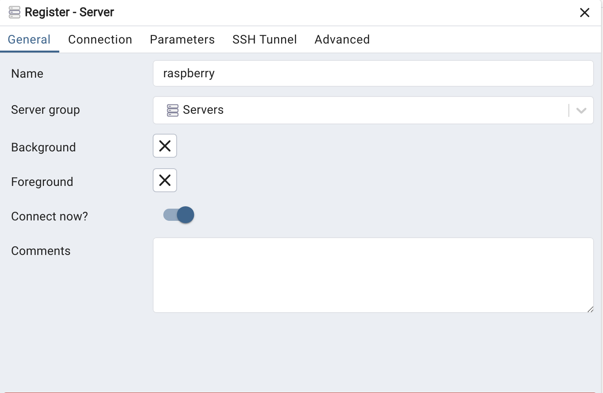
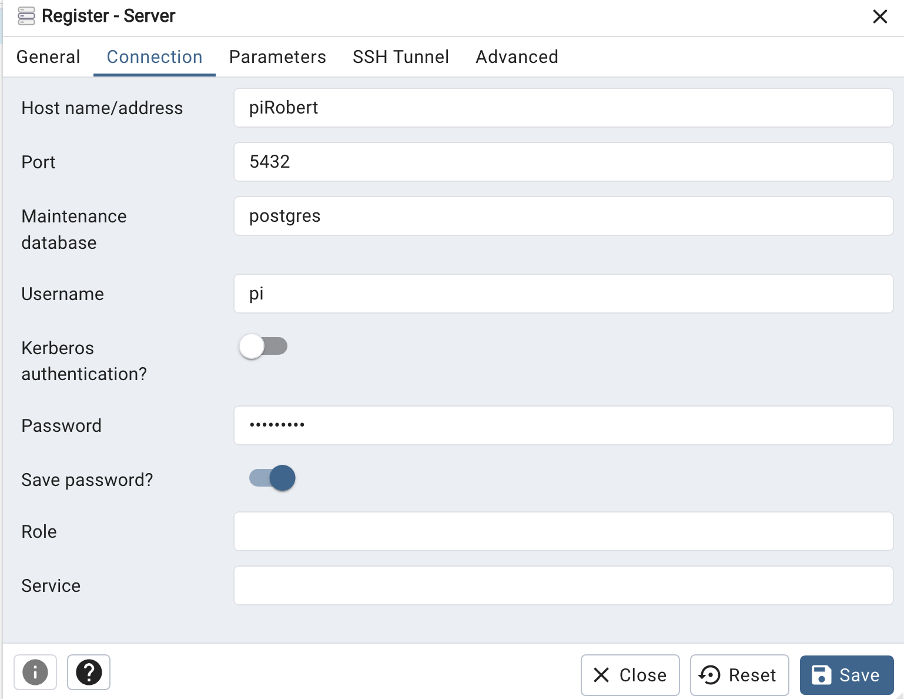

## postgreSQL on raspberry pi

### 1. 安裝
#### 1.1 更新raspberry

```bash
sudo apt update
sudo apt upgrade
``` 

#### 1.2. 安裝postgresql

```bash
sudo apt install postgresql
```

#### 1.3. 建立postgres user

##### 1.3.1 以root user設定postgres

```bash
sudo su postgres
```

##### 1.3.2 建立使用者pi

```bash
createuser pi -P --interactive
```

##### 1.3.3 輸入密碼

```bash
Enter password for new role:
Enter it again:
```

##### 1.3.4 詢問是否為最高管理的使用者
- ###### 按:y

```bash
Shall the new role be a superuser? (y/n) y
```

##### 1.3.5 離開postgresql的設定

```bash
exit
```

### 2. 環境設定(主要是要讓外部pgadmin4可以連線)

#### 2.1 更改postgresql.conf

```bash
sudo vim /etc/postgresql/版本號碼/main/postgresql.conf
```

#### 2.2-1 將listen_addresses由'localhost'更改為'*'

#### 2.2-2 將max_connections更改為1000

```
#postgresql.conf
listen_addresses '*'
max_connections 1000
```

#### 2.3 更改pg_hba.conf

```bash
sudo vim /etc/postgresql/版本號碼/main/pg_hba.conf
```

#### 2.4 將IPv4由127.0.0.1/32 更改為 0.0.0.0/0
#### 2.5 將IPv6由::1/128 更改為 ::/0
#### 2.6 重啟服務

```bash
sudo service postgresql restart
```

### 3. pgadmin4設定

#### 3.1 註冊新server
#### 3.2 建立server name

#### 3.3 建立connection 
- ##### Host name/address
- ##### Port 使用預設
- ##### Maintenance DataBase 使用預設
- ##### Username
- ##### Password
- ##### Save Password



### 4. 使用命令列(psql)增加使用者
#### 4.1 登入
- pi 是username
- postgres是進入的database
- localhost是本機
```
psql -U pi -d postgres -h localhost
```

#### 4.2 檢查目前的使用者
- **4.2.1 psql語法**

```
postgres-# \du
```

- **4.2.2 sql語法**

```sql
SELECT * FROM pg_roles;
```

#### 4.3 新增使用者
**沒有建立資料表的權限**

```
#sql-新增使用者
CREATE USER new_user WITH PASSWORD 'password';
```

**增加使用者建立資料庫的權限**

```
#sql
ALTER USER user WITH CREATEDB;
```

**新增使用者,並同時給予建立資庫的權利**

```
CREATE ROLE your_username WITH LOGIN PASSWORD 'your_password' CREATEDB;
```

#### 4.4 刪除使用者

```
#sql
DROP USER IF EXISTS user_1;
DROP USER IF EXISTS user_1,user_2...,user_n; 
```

#### 4.3 使用者可以透過pgAdmin4連線至postgres server

