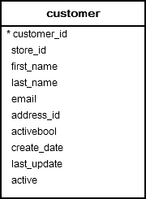

## HAVING子句

- 過濾GROUP BY後的子句
- HAVING 後面要用聚合函式
- FROM->WHERE->GROUP BY->HAVING->ORDER BY->LIMIT

### 使用dvd_rental的資料庫


### 使用HAVING子句和SUM()
- 取出訂單總合的金額大於200美金的客戶

```sql
SELECT customer_id,SUM(amount) AS 總合
FROM payment
GROUP BY customer_id
HAVING SUM(amount) > 200
ORDER BY 總合 DESC;
```

#### 結果:

```sql
customer_id | 總合
-------------+--------
         148 | 211.55
         526 | 208.58
```


### 每間店的客戶數量
#### customer資料表



```sql
SELECT store_id, COUNT(customer_id) AS 數量
FROM customer
GROUP BY
```

#### 結果:

```
store_id | 數量
----------+-------
        1 |   326
        2 |   273
(2 rows)
```

#### 找出大於300的客戶數

```sql
SELECT store_id, COUNT(customer_id) AS 數量
FROM customer
GROUP BY store_id
HAVING COUNT(customer_id) > 300;
```

#### 結果

```
store_id | count
----------+-------
        1 |   326
(1 row)
```
