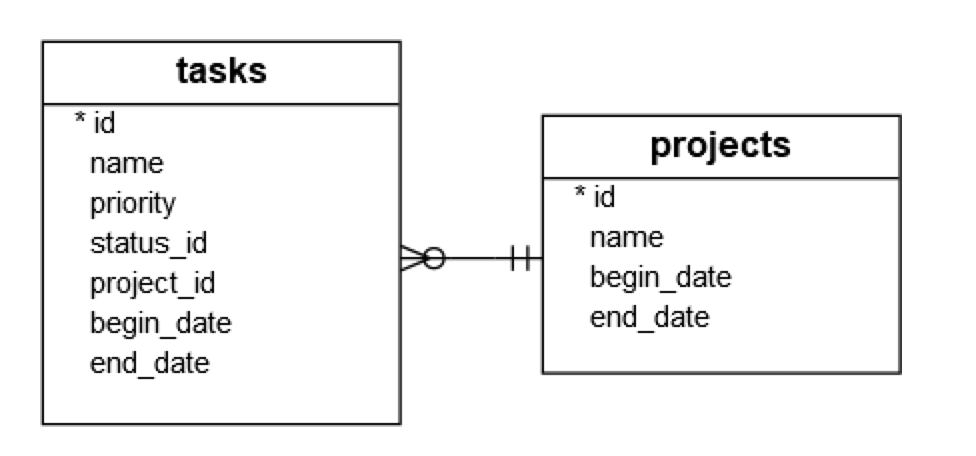

# 使用python建立sqlite建立資料表
- 使用connect()方法建立Connection物件
- 使用Connection的cursor()建立Cursor物件
- 使用CREATE TABLE語法和Cursor物件的execute()方法建立project和tasks2個資料表



## 建立projects資料表的SQL語法

```sql
CREATE TABLE IF NOT EXISTS projects(
		id integer PRIMARY KEY,
		name text NOT NULL,
		begin_date text,
		end_date text
);
```

## 建立tasks資料表的SQL語法

```sql
CREATE TABLE IF NOT EXISTS task(
	id integer PRIMARY KEY,
	name text NOT NULL,
	priority integer,
	project_id integer NOT NULL,
	status_id integer NOT NULL,
	end_date text NOT NULL,
	FOREIGN KEY(project_id) REFERENCES projects(id)
);
```


## 建立程式碼

```python
import sqlite3
from sqlite3 import Error

def create_connection(db_file):
    """
    建立資料庫和連線至資料庫
    :param db_file: 資料庫的檔案名稱
    :return: Connection物件
    """
    conn = None
    try:
        conn = sqlite3.connect(db_file)
        print(sqlite3.version)
    except Error as e:
        print(e)

    return conn

def create_table(conn, create_table_sql):
    """
    透過Connection物件和SQL語法建立資料表
    :param conn: Connection物件
    :param create_table_sql: 字串SQL語法
    :return:None
    """

    try:
        cursor = conn.cursor()
        cursor.execute(create_table_sql)
    except Error as e:
        print(e)

def main():
    database = "pythonsqlite.db"
    sql_create_projects_table = """
    CREATE TABLE IF NOT EXISTS projects(
		id integer PRIMARY KEY,
		name text NOT NULL,
		begin_date text,
		end_date text
    );
    """

    sql_create_tasks_table = """
    CREATE TABLE IF NOT EXISTS task(
	id integer PRIMARY KEY,
	name text NOT NULL,
	priority integer,
	project_id integer NOT NULL,
	status_id integer NOT NULL,
	end_date text NOT NULL,
	FOREIGN KEY(project_id) REFERENCES projects(id)
    );
    """

    #建立資料庫和Connection物件
    conn = create_connection(database)
    if conn is not None:
        create_table(conn,sql_create_projects_table)
        create_table(conn, sql_create_tasks_table)
    else:
        print("Error! 無法建立資料連線")


if __name__ == "__main__":
    main()

```


