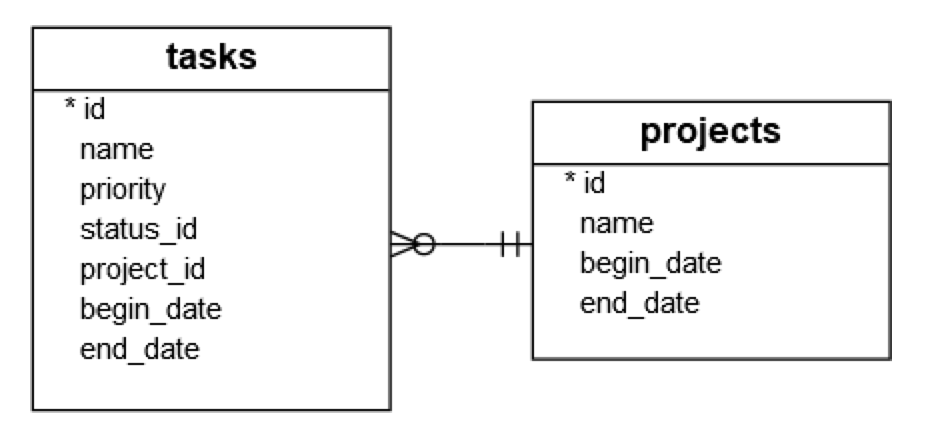

# 使用python選取資料
- 建立Connection物件
- 建立Cursor物件
- 使用SELECT語法選取資料
- 使用fetchall()方法取得資料



```python
import sqlite3
from sqlite3 import Error

def create_connection(db_file):
    """
    建立資料庫和連線至資料庫
    :param db_file: 資料庫的檔案名稱
    :return: Connection物件
    """
    conn = None
    try:
        conn = sqlite3.connect(db_file)
        print(sqlite3.version)
    except Error as e:
        print(e)

    return conn

def select_all_tasks(conn):
    """
    選取task內所有的資料
    :param conn: Connection物件
    :return:
    """

    cursor = conn.cursor()
    cursor.execute("SELECT * FROM task")
    rows = cursor.fetchall()

    for row in rows:
        print(row)

def select_task_by_priority(conn, priority):
    """
    選取task資料表,透過priority
    :param conn:Connection物件
    :param priority:數字
    :return:
    """
    cursor = conn.cursor()
    cursor.execute("SELECT * FROM task WHERE priority=?", (priority,))
    rows = cursor.fetchall()

    for row in rows:
        print(row)


def main():
    database = "pythonsqlite.db"

    #建立資料庫和Connection物件
    conn = create_connection(database)
    with conn:
        print("1.透過priority選取資料")
        select_task_by_priority(conn, 1)

        print("2.選取task資料表內的所有資料")
        select_all_tasks(conn)


if __name__ == "__main__":
    main()
```


