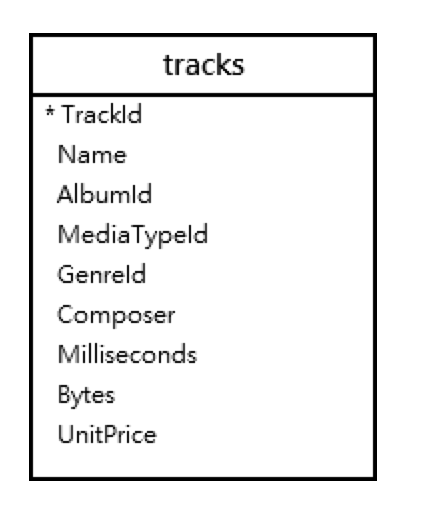

# 用DB_Browser操控sqlite
## 下載sqlite GUI視覺化工具 [DB Browser for SQLite](https://sqlitebrowser.org/dl/)

## 建立資料庫

```
按建立資料庫
```

## 建立資料表

### sqlite的資料類型

| 類型 | 說明 |
|:--|:--|
| NULL | 空的或不知道的資料 |
| INTEGER | 正整數或負整數 |
| REAL | 浮點數 |
| TEXT |  文字 |
| BLOB | binary資料，如照片或影片 |
### 語法:

```
CREATE TABLE [IF NOT EXISTS] [schema_name].table_name (
		column_1 data_type PRIMARY KEY,
   	column_2 data_type NOT NULL,
		column_3 data_type DEFAULT 0,
		table_constraints
) [WITHOUT ROWID];
```

### 範例:

```
CREATE TABLE IF NOT EXISTS contacts (
	contact_id INTEGER PRIMARY KEY,
	first_name TEXT NOT NULL,
	last_name TEXT NOT NULL,
	email TEXT NOT NULL UNIQUE,
	phone TEXT NOT NULL UNIQUE
);
```

## 從csv匯資料至sqlite

```
將city.csv 手動匯入至資料庫內
```

## insert 操作


### 語法:
```
INSERT INTO table1 (column1,column2 ,..)
VALUES 
   (value1,value2 ,...),
   (value1,value2 ,...),
    ...
   (value1,value2 ,...);
```

### 新增一筆資料

- 匯入artists.csv

```
INSERT INTO artists (name)
VALUES('Bud Powell');
```

### 新增多筆資料

```
INSERT INTO artists (name)
VALUES
	("Buddy Rich"),
	("Candido"),
	("Charlie Byrd");
```

## 選取資料

### 語法:

```
SELECT DISTINCT column_list
FROM table_list
```

### 選取範例

- 匯入tracks.csv



```
SELECT
	trackid,
	name,
	composer,
	unitprice
FROM
	tracks;
```

```
SELECT * FROM tracks;
```

## ORDER BY操作

### 語法

```
SELECT
   select_list
FROM
   table
ORDER BY
    column_1 ASC,
    column_2 DESC;
```

### ORDER BY範例

- 匯入tracks.csv

```
SELECT
	name,
	milliseconds, 
	albumid
FROM
	tracks
ORDER BY
	albumid ASC;
```

```
SELECT
	name,
	milliseconds, 
	albumid
FROM
	tracks
ORDER BY
	albumid ASC,
  milliseconds DESC;
```


## UPDATE操作

```

```

## DELETE操作

```

```

